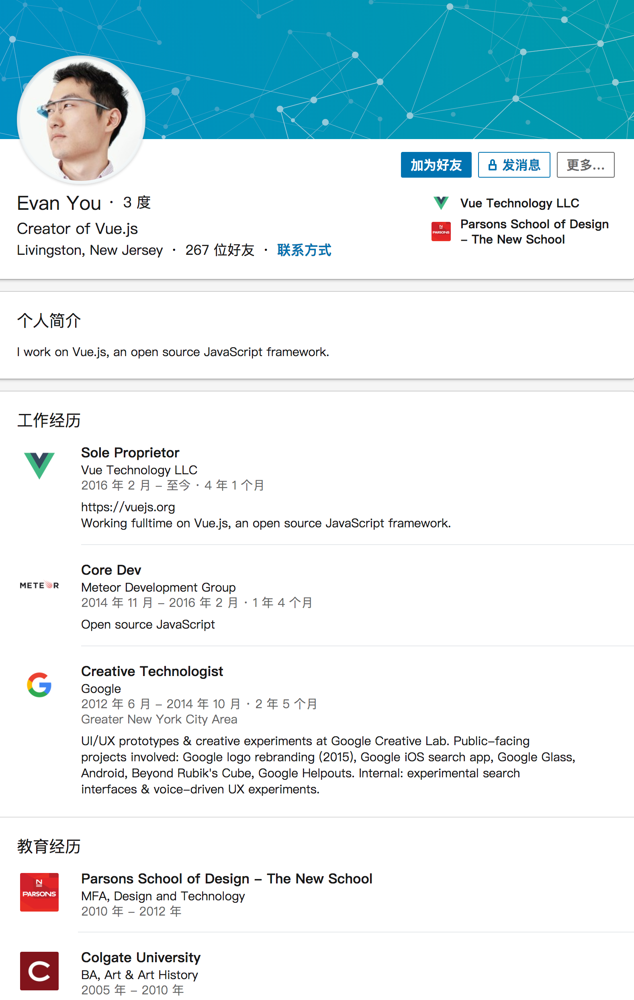

title: 复盘：Vue.js 是如何成功的
date: 2020-2-27 00:10:00
categories: 前端
tags: [Vue.js]
---
前几天 Vue.js 发布了纪录片，恰巧我从 2015 年就在生产环境使用过 Vue 1.0，看着 Vue 从 1.0 到 3.0、从前端框架混战到三足鼎立，虽然后来在生产环境中使用 Vue 并不多，但也一直保持着对 Vue 和 Evan 的关注。所以这次我想从纪录片内容入手，谈谈 Vue 是如何成功的。  



<!-- more -->

## Vue 作者尤雨溪的四个阶段
Vue.js 的作者尤雨溪讲了自己作为开发者的四个阶段：学生阶段、就职 Google 阶段、就职 Meteor 阶段和全职 Vue 阶段。这与他的 LinkedIn [个人主页](https://www.linkedin.com/in/evanyou/)也是对应的：

### 学生阶段
尤雨溪本科专业是艺术史，研究生是艺术与科技，这时候才真正接触计算机。在学生阶段关注 Web 新技术并使用新技术实现了复杂交互，因此受到了 Google 招聘的关注，一毕业就加入了 Google Creative Lab。

### 就职 Google 阶段
因为工作需要，开发一些不同于寻常的 Web 应用，于是尤雨溪尝试了框架 Backbone 和 Angular，接着想尝试去自己做一个框架，能实现 DOM 与 JS 对象的映射关系，来满足自己所遇到的场景。  
尤雨溪从 2013 年六月开始开发这个框架，最初叫 Seed.js ，但是 Seed.js 已经在 npm 上被占用了；由于这是一个 View 层的库，但是直接叫 View 似乎太直白了，通过 Google 翻译发现了 view 的法语翻译 vue，只有三个字母，看上去很酷，在 npm 没有被占用，于是就有了 Vue 这个名字。  
Vue 最初作为一个个人项目发布，此时 Vue 大约有三位数的用户（由 GitHub Star 数量推测来），这也是一批早期用户。  
这时候尤雨溪还没想过这个可以挣钱，只是纯粹的兴趣。同时尤雨溪觉得有做框架的经验可能会对之后找工作有帮助，所以加入了 Meteor，开始了就职 Meteor 的阶段。

### 就职 Meteor 阶段
尤雨溪依然在利用自己的个人时间开发 Vue，直到某一天，知名 PHP 框架作者 Laravel 作者发推说学 React 太难了，学 Vue 更简单，公开表示 Vue 很不错，因此吸引了一批 Laravel 开发者来使用 Vue。  
在这之后，在前端社区内有着不少讨论要不要使用 Vue 的问题，为了证明 Vue 和证明自己，尤雨溪花了 2015 年所有的假期，完善了框架和文档，在十月份发布了 1.0 正式版。  
1.0 发布后尤雨溪开始考虑全职开源工作，这面临着 Meteor VS Vue 的选择：
- Meteor 只是个开发者，Vue 可以从更高层的角度去做设计；
- 同时 Meteor 使用者越来越少，而 Vue 越来越多；
于是尤雨溪这时候下定决心开始全职开发 Vue 的工作。

### Vue.js 全职阶段
最初的问题是思考如何养活自己，尤雨溪先开了一个 Patreon 账户，每个月大约能收到近 2000 刀；同时一家叫 Strikingly 的公司，有着一个小的开源基金，在 Strikingly 的支持下，尤雨溪得以全身心的投入 Vue 的开发。

## 纪录片带来的思考
### 框架不只是代码
纪录片中 Vue Core Team 成员 [LinusBorg (Thorsten Lünborg)](https://github.com/LinusBorg) 讲述了他加入 Vue Core Team 的故事：
早期 Vue 1.0 刚发布时，Core Team 实际上还不存在，作者都在忙于解决 Issue、更新文档等等，Vue 论坛还是一片荒地，而 LinusBorg 在 Vue 社区非常活跃，熟悉各种常见的使用问题，热情的帮助大家；在三四个月后 Evan 发送了 Slack 邀请，但是这个时候实际上他还没有提过 Issue 或者 Commit。  
这其实背后是一个很重要的事实：框架不只是代码，文档、社区、工具链非常重要，甚至某种程度上比代码更重要。这也是 LinusBorg 在没有做出任何代码层面的贡献但是被邀请加入 Core Team 的原因：他是一位社区领袖。

### 框架设计是 Trade Off 的结果
YouTube Vue.js 教程作者 Scott 提到了在 Vue 出现的时候前端框架的选择难题：
> Angular 2 与 1 之间存在非常大的差异，这导致 Angular 流失了大量的用户；React 带来了很多新颖的东西，但是上手有一定成本，无法像 Angular.js 那样打开一个新的 HTML 文件引入一个 CDN JS 文件就可以直接使用。  

这时候 Vue 填补了这部分空缺：既想要上手容易、又想要强大和灵活性，Vue 在这其中是平衡性做的最好的框架，这给 Vue 带来了一些用户。

尤雨溪在 JSConf Asia 2019 也做过一个关于框架设计平衡性的演讲，在这方面有比较深入的分享，这里建议可以看一看（见参考资料「Seeking the Balance in Framework Design」）。

### 文档的重要性
有很大部分的中国开发者在学习框架时更期望有中文文档，而一些技术名字很难翻译到位。在这一点上 Vue 的中文文档很友好，因为尤雨溪是一个中国人，同时编写中英文文档，能够灵活地遣词造句。  

其实尤雨溪在纪录片中没有特地提到的是，尤雨溪的英文也非常的好（当然纪录片是英文的，这也不用特地去说明了），这给 Vue 在国外的推广带来了极大的优势。尤雨溪曾在知乎分享过他学习英语的经验（见参考资料「请各位知友分享下自己的英语学习经验吧？」），其实国内优秀的库、框架很多，但有不少限制于作者的英语能力，没有提供相关的英文文档，无形中失去了很多的外国用户；或是限制于英语口语能力，无法在国外的技术会议上进行推广，触达更多的开发者。

### 版本升级 API 的兼容性
纪录片中一带而过的是 Vue Conf 中提到的关于兼容性处理的方案。不得不提 Vue 在 API 设计上一直做得很稳，例如 Vue 2 发布时 API 与 Vue 1 的差异很小，Vue 3 抛开 Composition API ，与 Vue 2 差异也不大。同时 Vue 2 也有 Composition API 的插件可以使用。

反观 Angular 从 1 到 2 完全是两个框架，或多或少流失了原有的用户，并给正在使用的用户带来了升级版本成本的心智负担。

### Vue 体积与性能优势
在国内为代表的国家地区网络环境情况复杂，用户量越大越复杂的 2C 产品越重视这点。而 Vue 有着相对 Angular 和 React 来说更小的体积和更好的性能，且这个优势到了 Vue 3 有了更近一步的提升，Vue 3 一定程度上参考了 Svelte 的设计，通过更多的编译期优化减小 runtime 体积，更多可以参考尤雨溪在知乎上关于 Svelte 的回答和关于 Vue 3 的分享。

### 技术社区的影响力输出
纪录片中 CSS 专家 Sarah 讲了她和 Vue 的故事：一开始写了一篇 Vue 相关的文章，接着写成了一个系列，接着就一直写了下去；同时她贡献了 Vue VSCode Snippets 插件，并加入了 Vue Core Team。在 Vue 流行之前，Sarah 就已经是社区知名的 CSS 专家，有着很大的影响力，她写的关于 Vue 的技术文章自然会给 Vue 引来更多的用户。

在国内，尤雨溪也曾在阿里内部做过 Vue 的分享，与阿里内部的前端一起推进 Vue 的落地，同时百度等知名公司也在使用 Vue，这些给 Vue 带来了大厂背书。Weex 与 Vue 的合作也是一种探索，虽然现在 Weex 似乎已经没人提起了。另外尤雨溪本身在知乎也是一位技术大 V，在知乎的活跃或多或少给 Vue 在国内的推广带来了一定的帮助。

在另一方面，程序员大多有一种对开源的信仰，尤雨溪是为数不多的做出了世界级开源方案、也是世界顶尖的程序员和开源领袖。并且 Vue 不是一个商业公司驱动的，反观 React 曾经的 License 事件，这一点也给很多开发者和团队在选择框架时增加了对 Vue 的倾向性。这些都给 Vue 和尤雨溪带来了认可、尊重和声望。

## 小结
回顾 Vue 的发展历史，会发现做一个技术框架和做一个产品很相似，不是产品有很厉害的功能就能得到大量的用户，框架也不是技术厉害就能火起来：

|产品|框架|
|---|---|
|在设计产品时需要思考你的用户群体是谁，产品功能设计的平衡性会决定你的产品能不能吸引更多的用户。|在设计框架时需要思考你的用户群体是谁，框架架构和 API 设计的平衡性会决定你的框架能不能吸引更多的用户。|
|交互上手体验越友好，越能够吸引用户和提升留存。|框架文档、周边生态设施越完善，学习和上手成本越低，越能够吸引用户。|
|产品在版本升级时，应该做好用户的引导，如果出现比较大的功能断层，很容易流失用户。|框架在版本升级时，应该做好 API 的兼容性，breaking changes 会导致用户的流失。|
|再好的产品也需要投放、推广和拉新。|再好的框架也需要通过各种形式做分享和推广。|
|如果错过了赛道的某个时间点，可能再也没有做一款大众化产品的机会了。|如果错过了技术方向的某个时间点，可能再也没有做一款能吸引大量用户的框架的机会了。|

当然也许你的目标没有做一个很多人都在使用的框架那么大，而是想借助某项技术的兴起，得到心仪公司的 offer / 成为这个领域的技术专家等等，这其实也是很常见的一种现象：**技术投机**。如果我们将**技术投机**这个词作为一个中性化的词去看待，其实 Vue.js Documentary 也给我们带来了一些启示：
- 在一项技术有兴起苗头的时候，这个时候是参与社区构建门槛最低的时机；
- 参与社区构建，提 PRs / Issues 不是唯一的途径，积极的解答问题、帮忙做 Code Review 等等都是贡献的方式，其实门槛很低；
- 学好英语。

## 参考资料
- [Vue.js: The Documentary](https://www.youtube.com/watch?v=OrxmtDw4pVI)
- [Vue作者尤雨溪为你分享：Vue 3.0 进展@VueConf CN 2018](https://www.youtube.com/watch?v=a4N1Sz_Y5Pg)
- [Evan You on Vue.js: Seeking the Balance in Framework Design | JSConf.Asia 2019](https://www.youtube.com/watch?v=ANtSWq-zI0s)
- [请各位知友分享下自己的英语学习经验吧？ - 知乎](https://www.zhihu.com/question/20118811/answer/14036822)
- [如何看待 svelte 这个前端框架？ - 知乎](https://www.zhihu.com/question/53150351/answer/133912199)
